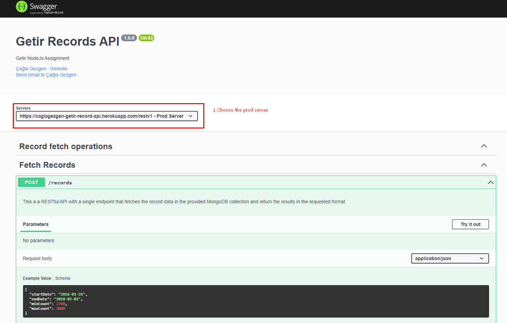
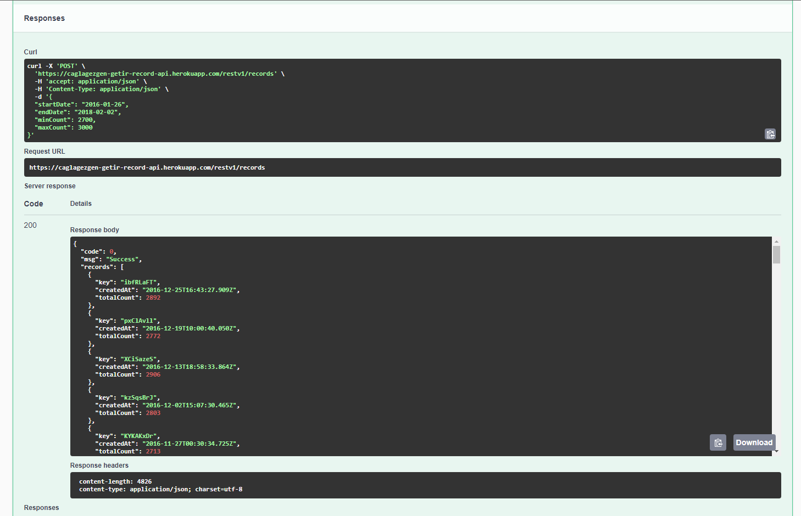

# Getir Node.js Challenge
* This a a RESTful API with a single endpoint that fetches the data in the provided MongoDB collection and return the results in the requested format.

## Heroku Demo Link
> 

## Description
- This a a RESTful API with a single endpoint that fetches the record data in the provided MongoDB collection and return the results in the requested format.
- The endpoint just handle HTTP POST requests.

## Build with
* Package manager NPM
* Express Framework with Node.js
* MongoDB with Mongoose
* Validation with Joi
* Logger with Winston and Morgan
* Documentation with Swagger 
* Test with supertest and jest
* Published with Heroku

## Geting Started
* Npm is used for package manager. So use npm for installing packages.
> 1. Clone this repo and run `npm install` to install all the dependencies.
> 2. Add `.env` file for to set neccessary environment variables. Check out `.env.example` for creating your `.env` file.
> 3. Run project with `npm run dev`
> 4. Test project with `npm run test`

## API Docs
* Api documentation is available at [Getir-Records-Api-Docs](http://localhost:3000/api-docs/#/Fetch%20Records/Fetch%20Records)

## Demo 
1.  Welcome to Getir Record Api.

 

2. Execute the query.

 

3. Execute the query.

 

4. Error responses.

 

5. All Schemas.

 

 ## Contact
- You can contact me from: caglagzgn@gmail.com

